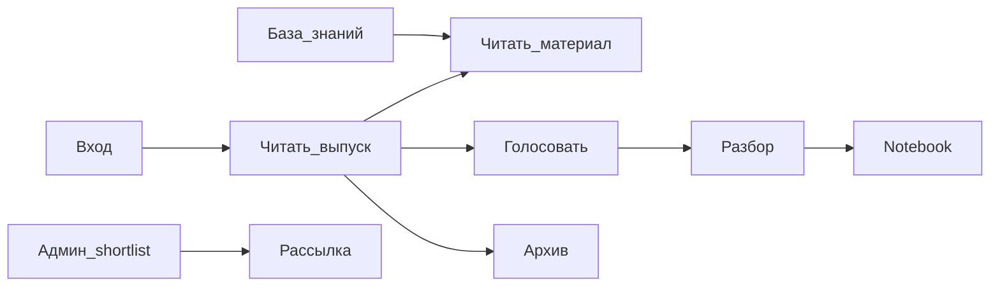

# User Story Mapping — Digest CDS (Concept 3)

**UI-концепция:** Concept 3 — Editorial UI («Digest CDS: издание»)  
**Прототип:** [Concept_3/](Concept_3/) · [README](Concept_3/README.md) · [UI-SPEC_3.md](Concept_3/UI-SPEC_3.md)  
**Выбор концепта:** [choice_concept.md](choice_concept.md)  
**Доменный язык:** [CONTEXT.md](../../CONTEXT.md)  
**Недостатки UI (не дублируются здесь):** [backlog_UI.md](backlog_UI.md)  
**Критерии приёмки (Given/When/Then):** [acceptance_criteria.md](acceptance_criteria.md)

Карта описывает **счастливые / нормальные** сценарии использования editorial-продукта: внешний источник → исходный текст → подготовленная агентом статья → выпуск → голосование → разбор → админ-рассылка. Видео/аудио не являются материалом и не сохраняются в системе как материал. Без геймификации Concept 2. **Data Analyst** и **Data Scientist** — разные роли в Сбере (не склеивать в «DS-эксперт»).

Каждая статья проходит анализ и уточняющий поиск, может быть практическим гайдом по установке/использованию технологии или описанием нового подхода. Если в ней используется сложный термин, которому уже посвящена отдельная статья, статья должна ссылаться на неё при первом уместном упоминании; связи между материалами поддерживаются взаимными ссылками или блоком связанных статей.

---

## 1. Personas

### 1.1 Рядовой сотрудник СВА

| | |
|--|--|
| **Кто** | Сотрудник Службы внутреннего аудита без DS-специализации |
| **Цель** | Быстро понять, какие новые технологии релевантны аудиту |
| **Мотивация** | Прочитать еженедельный выпуск, отдать один голос за полезную тему, найти краткое объяснение без жаргона |
| **Экраны C3** | `login` → `issue` → `material` / `voting` / `archive` / `knowledge` |
| **Pain points** | DS-жаргон в заголовках; неясная ценность «зачем СВА»; ложное ощущение, что голос уже отдан |

### 1.2 Data Analyst

| | |
|--|--|
| **Кто** | Аналитик данных в СВА: SQL, BI, дашборды, метрики контролей (**не** обучение моделей) |
| **Цель** | Найти практики отчётности, качества данных и аналитики, применимые в аудите |
| **Мотивация** | Отфильтровать ML-шум, открыть материал под свою роль, при необходимости проголосовать за тему для аналитиков |
| **Экраны C3** | `knowledge` (ролевые фильтры), `material`, `issue`, `voting` |
| **Pain points** | Дефолтная RAG/ML-выдача; теги только `#RAG`/`#LLM`; нет facet «для аналитика» |

### 1.3 Data Scientist

| | |
|--|--|
| **Кто** | Data Scientist в СВА: модели, эксперименты, evaluation; готовит **разбор** с `.ipynb` (роль «Автор контента» в CONTEXT — активность этой персоны) |
| **Цель** | Глубоко разобрать победившую тему и дать коллегам воспроизводимый notebook |
| **Мотивация** | Найти методы, открыть longread разбора, скачать `.ipynb`, участвовать в цикле голосования |
| **Экраны C3** | `razbory` / `razbor`, `knowledge`, `material`, `voting` |
| **Pain points** | Поверхностный разбор без метрик; disclaimer nbconvert без ссылки на notebook |

### 1.4 Админ (CDS / делегат)

| | |
|--|--|
| **Кто** | CDS или делегат: утверждает shortlist дайджеста и инициирует рассылку |
| **Цель** | За минимальное время утвердить корректный топ материалов и безопасно отправить дайджест |
| **Мотивация** | Triage кандидатов, превью письма, явный статус ready перед send |
| **Экраны C3** | `admin-digest` (+ preview) |
| **Pain points** | Чекбоксы без Approve/Reject; нет draft/ready; неработающий «Предпросмотр письма» в прототипе |

---

## 2. Backbone карты (активности → истории)

Горизонталь — поток продукта в метафоре издания. Под каждой колонкой — ID историй (Must сверху).

```text
Вход          Выпуск           Материал        Голосование     База знаний      Разборы         Админ            Архив
────────────  ───────────────  ──────────────  ──────────────  ───────────────  ──────────────  ───────────────  ──────────
US-01 Must    US-03 Must       US-07 Must      US-10 Must      US-14 Must       US-18 Must      US-22 Must       US-28 Must
US-02 Must    US-04 Must       US-08 Must      US-11 Must      US-15 Must       US-19 Must      US-23 Must
              US-05 Should     US-09 Should    US-12 Must      US-16 Must       US-20 Must      US-24 Must
              US-06 Nice                       US-13 Should    US-17 Should     US-21 Should    US-25 Must
                                                                                US-29 Nice      US-26 Should
                                                                                                US-27 Nice
                                                                                                US-30 Nice
```



---

## 3. User Journeys (счастливые пути)

### J1. Сотрудник СВА — еженедельный выпуск

| Шаг | Экран C3 | Действие | Результат |
|-----|----------|----------|-----------|
| 1 | Email / закладка | Переходит по ссылке на Digest CDS | Открывается вход или текущий выпуск |
| 2 | `login.html` | Входит с `@sberbank.ru` / `@omega.sbrf.ru` | Сессия авторизована |
| 3 | `issue.html` | Читает обложку выпуска и EditorialCallout | Понимает номер выпуска и что голосование открыто |
| 4 | `issue.html` | Выбирает пункт оглавления (IssueTOC) | Переходит к материалу |
| 5 | `material.html` | Читает подготовленную статью (prose + TOC) | Получает проверенное объяснение, применение к аудиту и ссылки на связанные статьи |
| 6 | (опц.) `voting.html` | Открывает «Выбрать тему →» | Готов отдать голос (см. J2) |

### J2. Сотрудник СВА — отдать голос в цикле

| Шаг | Экран C3 | Действие | Результат |
|-----|----------|----------|-----------|
| 1 | `issue.html` | Кликает callout «Выбрать тему →» | Открывается TopicBallot |
| 2 | `voting.html` | Видит статус «Ваш голос: не отдан» и список тем | Понимает правила цикла (один голос, срок) |
| 3 | `voting.html` | Выбирает тему radio и подтверждает | Голос зафиксирован |
| 4 | `voting.html` | При необходимости меняет выбор до закрытия окна | Актуальный выбор отображается явно |

### J3. Data Analyst — найти практику для отчётности

| Шаг | Экран C3 | Действие | Результат |
|-----|----------|----------|-----------|
| 1 | Header / `knowledge.html` | Открывает базу знаний | Пустой или роле-нейтральный поиск (не зашитый RAG) |
| 2 | `knowledge.html` | Задаёт запрос своими словами и/или фильтр роли **Data Analyst** | Выдача релевантна SQL/BI/DQ, не только ML |
| 3 | `knowledge.html` | Открывает MaterialListRow | Карточка материала |
| 4 | `material.html` | Читает подготовленную статью | Может перенести приём в аудиторскую отчётность и перейти к поясняющим статьям по терминам |

### J4. Data Scientist — подготовиться к разбору / провести разбор

| Шаг | Экран C3 | Действие | Результат |
|-----|----------|----------|-----------|
| 1 | `voting` / уведомление | Узнаёт победившую тему цикла | Тема назначена на разбор |
| 2 | `razbory.html` | Открывает список разборов | Находит нужную встречу/публикацию |
| 3 | `razbor.html` | Читает longread-статью (секции + sticky TOC) | Понимает метод, применение в аудите и связанные понятия |
| 4 | `razbor.html` | Скачивает / открывает `.ipynb` | Может воспроизвести демо и дополнить как автор |

### J5. Админ — утвердить и отправить дайджест

| Шаг | Экран C3 | Действие | Результат |
|-----|----------|----------|-----------|
| 1 | `admin-digest.html` | Открывает shortlist (топ-5 после авторанжирования) | Видит кандидатов и статусы |
| 2 | `admin-digest.html` | Включает / исключает материалы (Approve / Reject) | Состав дайджеста согласован |
| 3 | Preview | Открывает «Предпросмотр письма» | Проверяет финальный вид рассылки |
| 4 | `admin-digest.html` | Нажимает «Отправить дайджест» | Еженедельный дайджест уходит; копия в архиве выпусков |

### J6. Любой — вход с корпоративного домена

| Шаг | Экран C3 | Действие | Результат |
|-----|----------|----------|-----------|
| 1 | `login.html` | Вводит корпоративный email и проходит auth | Доступ только с разрешённого домена |
| 2 | — | Попадает на `issue.html` (или deep-link) | Работает в контексте своей роли |

---

## 4. Каталог User Stories

Формат: **Как [роль], я хочу [действие], чтобы [результат].**

### 4.1 Вход

| ID | Приоритет | История | Экран(ы) |
|----|-----------|---------|----------|
| **US-01** | Must have | Как **сотрудник СВА** (или любая роль), я хочу **войти с корпоративного email `@sberbank.ru` / `@omega.sbrf.ru`**, чтобы **получить доступ к Digest CDS**. | `login.html` |
| **US-02** | Must have | Как **авторизованный пользователь**, я хочу **после входа сразу попасть на текущий выпуск**, чтобы **начать чтение без лишней навигации**. | `login` → `issue` |

### 4.2 Выпуск (issue)

| ID | Приоритет | История | Экран(ы) |
|----|-----------|---------|----------|
| **US-03** | Must have | Как **рядовой сотрудник СВА**, я хочу **открыть текущий выпуск с обложкой и оглавлением**, чтобы **за минуту понять состав дайджеста**. | `issue.html` |
| **US-04** | Must have | Как **рядовой сотрудник СВА**, я хочу **увидеть редакционный callout о цикле голосования**, чтобы **знать срок и перейти к выбору темы**. | `issue.html` |
| **US-05** | Should have | Как **рядовой сотрудник СВА**, я хочу **видеть под заголовком материала короткое «зачем СВА» без жаргона**, чтобы **оценить пользу до чтения статьи**. | `issue.html` |
| **US-06** | Nice to have | Как **рядовой сотрудник СВА**, я хочу **получить выпуск также письмом со ссылкой на сайт**, чтобы **читать в привычном канале и углубляться в издании**. | email + `issue` |

### 4.3 Материал

| ID | Приоритет | История | Экран(ы) |
|----|-----------|---------|----------|
| **US-07** | Must have | Как **рядовой сотрудник СВА**, я хочу **читать материал в prose-колонке с оглавлением**, чтобы **спокойно усвоить текст как в издании**. | `material.html` |
| **US-08** | Must have | Как **Data Analyst** или **Data Scientist**, я хочу **открыть подготовленную статью из выпуска / базы**, чтобы **изучить детали метода или приёма без просмотра исходного видео**. | `material.html` |
| **US-09** | Should have | Как **читатель**, я хочу **видеть, что материал является подготовленной статьёй, понимать его происхождение и переходить по ссылкам на связанные статьи**, чтобы **отличать анализ от исходного текста и разобраться в сложных терминах**. | `material.html`, `issue` |

### 4.4 Голосование

| ID | Приоритет | История | Экран(ы) |
|----|-----------|---------|----------|
| **US-10** | Must have | Как **рядовой сотрудник СВА**, я хочу **отдать один голос за тему в цикле голосования**, чтобы **влиять на тему ближайшего разбора**. | `voting.html` |
| **US-11** | Must have | Как **участник голосования**, я хочу **видеть честный статус «голос не отдан» без предвыбранной темы**, чтобы **не подтвердить чужой выбор по ошибке**. | `voting.html` |
| **US-12** | Must have | Как **участник голосования**, я хочу **изменить свой голос до закрытия окна цикла**, чтобы **исправить выбор при новой информации**. | `voting.html` |
| **US-13** | Should have | Как **рядовой сотрудник СВА**, я хочу **видеть краткое описание темы на языке аудита и число материалов**, чтобы **голосовать осознанно**. | `voting.html` |

### 4.5 База знаний

| ID | Приоритет | История | Экран(ы) |
|----|-----------|---------|----------|
| **US-14** | Must have | Как **любой авторизованный пользователь**, я хочу **искать в базе знаний своими словами**, чтобы **найти карточку знаний по смыслу, а не только по точному названию**. | `knowledge.html` |
| **US-15** | Must have | Как **Data Analyst**, я хочу **отфильтровать выдачу под роль аналитика (SQL/BI/DQ)**, чтобы **не тонуть в ML/RAG-материалах**. | `knowledge.html` |
| **US-16** | Must have | Как **Data Scientist**, я хочу **находить материалы по методам ML и экспериментам**, чтобы **готовить разбор и углублять практику**. | `knowledge.html` |
| **US-17** | Should have | Как **Data Analyst**, я хочу **увидеть честный empty state**, если по запросу нет аналитического контента, чтобы **не принять ML-выдачу за релевантный ответ**. | `knowledge.html` |

### 4.6 Разборы

| ID | Приоритет | История | Экран(ы) |
|----|-----------|---------|----------|
| **US-18** | Must have | Как **Data Scientist** или **сотрудник СВА**, я хочу **открыть список разборов**, чтобы **найти нужную встречу или публикацию**. | `razbory.html` |
| **US-19** | Must have | Как **читатель разбора**, я хочу **читать longread с sticky TOC**, чтобы **навигировать по секциям метода и применения в аудите**. | `razbor.html` |
| **US-20** | Must have | Как **Data Scientist (автор контента)**, я хочу **скачать или открыть `.ipynb` разбора**, чтобы **воспроизвести демонстрацию**. | `razbor.html` |
| **US-21** | Should have | Как **Data Scientist**, я хочу **видеть в разборе блок оценки качества (метрики)**, чтобы **оценить пригодность метода для аудита**. | `razbor.html` |

### 4.7 Админ (shortlist и рассылка)

| ID | Приоритет | История | Экран(ы) |
|----|-----------|---------|----------|
| **US-22** | Must have | Как **админ (CDS / делегат)**, я хочу **видеть shortlist кандидатов дайджеста (топ-5)**, чтобы **утвердить состав недели**. | `admin-digest.html` |
| **US-23** | Must have | Как **админ**, я хочу **явно включать и исключать материалы (Approve / Reject)**, чтобы **контролировать, что уйдёт в рассылку**. | `admin-digest.html` |
| **US-24** | Must have | Как **админ**, я хочу **видеть статус draft vs ready у кандидата**, чтобы **не отправить незавершённый материал**. | `admin-digest.html` |
| **US-25** | Must have | Как **админ**, я хочу **открыть превью письма перед отправкой**, чтобы **проверить финальный вид дайджеста**. | `admin-digest` + preview |
| **US-26** | Should have | Как **админ**, я хочу **понять, почему материал попал в shortlist (факторы скоринга)**, чтобы **принять editorial-решение**. | `admin-digest.html` |
| **US-27** | Nice to have | Как **админ**, я хочу **массово отметить топ-N / select all**, чтобы **ускорить triage под дедлайн**. | `admin-digest.html` |

*Отправка дайджеста (результат J5) входит в US-25 как завершение happy path; отдельная формулировка:*

| ID | Приоритет | История | Экран(ы) |
|----|-----------|---------|----------|
| **US-31** | Must have | Как **админ**, я хочу **отправить утверждённый еженедельный дайджест**, чтобы **доставить подборку сотрудникам СВА и зафиксировать выпуск в архиве**. | `admin-digest.html` → `archive` |

### 4.8 Архив

| ID | Приоритет | История | Экран(ы) |
|----|-----------|---------|----------|
| **US-28** | Must have | Как **рядовой сотрудник СВА**, я хочу **открыть прошлый выпуск в архиве**, чтобы **вернуться к материалам предыдущих недель**. | `archive.html` |

### 4.9 Post-v1 / Nice (из CONTEXT, не в ядре C3)

| ID | Приоритет | История | Экран(ы) |
|----|-----------|---------|----------|
| **US-29** | Nice to have | Как **читатель**, я хочу **пройти карточку с вопросами после материала или разбора**, чтобы **проверить понимание** (после v1). | post-v1 |
| **US-30** | Nice to have | Как **админ**, я хочу **управлять YAML-конфигами пайплайна в веб-UI**, чтобы **менять источники и правила без деплоя** (расширение роли админа). | post-v1 |

---

## 5. Сводная таблица приоритетов

| Приоритет | ID |
|-----------|-----|
| **Must have** | US-01, US-02, US-03, US-04, US-07, US-08, US-10, US-11, US-12, US-14, US-15, US-16, US-18, US-19, US-20, US-22, US-23, US-24, US-25, US-28, US-31 |
| **Should have** | US-05, US-09, US-13, US-17, US-21, US-26 |
| **Nice to have** | US-06, US-27, US-29, US-30 |

**Итого:** 31 user story (21 Must · 6 Should · 4 Nice).

### Покрытие ролей (Must)

| Роль | Must stories |
|------|----------------|
| Рядовой сотрудник СВА | US-01…04, US-07, US-10…12, US-14, US-28 |
| Data Analyst | US-08, US-14, US-15 |
| Data Scientist | US-08, US-14, US-16, US-18…20 |
| Админ | US-22…25, US-31 |
| Все / auth | US-01, US-02 |

### Связь journeys → stories

| Journey | Stories |
|---------|---------|
| J1 Выпуск | US-01, US-02, US-03, US-04, US-07, (US-05) |
| J2 Голос | US-04, US-10, US-11, US-12, (US-13) |
| J3 Analyst | US-14, US-15, US-08, (US-17) |
| J4 Scientist / разбор | US-18, US-19, US-20, (US-21) |
| J5 Админ | US-22…25, US-31, (US-26, US-27) |
| J6 Login | US-01, US-02 |

---

## 6. Примечания

1. Термины (**дайджест**, **цикл голосования**, **материал**, **исходный текст**, **разбор**, **shortlist**, **разрешённый домен**) — по [CONTEXT.md](../../CONTEXT.md). Материал — только подготовленная агентом статья, не видео и не необработанный транскрипт.
2. Concept 3 сознательно **без** XP, streak, лидерборда и квизов (это Concept 2 / post-v1).
3. В CONTEXT «DS-эксперт» исторически смешивает аналитику и DS; в этой карте для Сбера зафиксированы отдельные роли **Data Analyst** и **Data Scientist**; подготовка `.ipynb` — обязанность Data Scientist (автор контента).
4. Детальные UI-дефекты прототипа — в [backlog_UI.md](backlog_UI.md); Should/Nice частично закрывают P0/P1 из backlog победителя C3.
