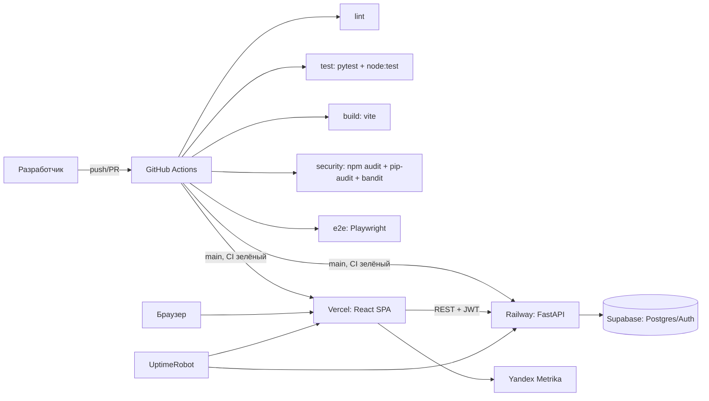

# Документация по интеграциям и CI/CD — Digest CDS

Документ описывает настройку CI/CD, интеграцию внешних сервисов (OAuth2 Яндекс ID,
Яндекс.Метрика), мониторинг, логирование и порядок получения ключей.

Связанные документы:

- Отчёт по безопасности: [`security_audit.md`](security_audit.md)
- AI-промпты для анализа логов: [`docs/agents/log-analysis-prompts.md`](docs/agents/log-analysis-prompts.md)
- Локальный запуск: [`README.md`](README.md), [`docs/agents/local-platform-runbook.md`](docs/agents/local-platform-runbook.md)

---

## 1. Архитектура и потоки



- **Frontend** — Vercel (статика Vite SPA).
- **Backend** — Railway (Docker, FastAPI + uv workspace).
- **Auth** — Supabase Auth (email/пароль + OAuth2 Яндекс ID).
- **Аналитика** — Яндекс.Метрика.
- **Мониторинг** — health-check endpoints + внешний мониторинг (UptimeRobot).
- **Логи** — структурированный JSON (`structlog`) → логи Railway/Vercel.

---

## 2. CI/CD (GitHub Actions)

### 2.1. Файлы

| Файл | Назначение |
|---|---|
| [`.github/workflows/ci.yml`](.github/workflows/ci.yml) | lint, unit, build, security, e2e — на каждый `push`/PR |
| [`.github/workflows/deploy.yml`](.github/workflows/deploy.yml) | деплой на Vercel и Railway после успешного CI на `main` |

### 2.2. Стадии CI

| Job | Что делает |
|---|---|
| `lint` | `uv run ruff check .`, `npm run lint --prefix web` (oxlint) |
| `backend-tests` | `uv sync --frozen`, `uv run pytest -q` |
| `frontend-tests` | `npm ci`, `node --test`, `npm run build` |
| `security` | `npm audit` (root + web), `pip-audit`, `bandit` |
| `e2e` | Playwright (`--project=web`), отчёт выгружается в artifact |

### 2.3. Автодеплой

`deploy.yml` запускается по `workflow_run` **только** когда CI на `main` завершился успешно
и запуск пришёл от push в основной репозиторий:

```yaml
github.event.workflow_run.event == 'push' &&
github.event.workflow_run.head_branch == 'main' &&
github.event.workflow_run.head_repository.full_name == github.repository
```

Это защищает секреты от выполнения недоверенного кода (см. SEC-01 в `security_audit.md`).

- Frontend → Vercel CLI (`vercel pull/build/deploy --prod`).
- Backend → POST на Railway Deploy Hook.

Если тот или иной секрет не задан, соответствующий job печатает «skipped» и не падает —
пайплайн остаётся зелёным до момента, когда вы добавите ключи.

### 2.4. Как проверить пайплайн

1. Закоммитить и запушить в любую ветку → откроется run `CI`.
2. Открыть вкладку Actions → убедиться, что все job зелёные.
3. Для деплоя — merge/push в `main`; после успешного CI запустится `Deploy`.

---

## 3. Порядок получения ключей и переменные

Выполняйте шаги по порядку. Имена переменных указаны точно — под ними значения
добавляются в `.env` (локально) или в GitHub Secrets / дашборды хостингов.

### Шаг 1. Supabase (уже используется проектом)

Из Supabase Dashboard → Project Settings → API взять:

| Переменная | Где взять | Назначение |
|---|---|---|
| `SUPABASE_URL` | Project URL | backend |
| `SUPABASE_PUBLISHABLE_KEY` | `anon`/publishable key | frontend (публичный) |
| `SUPABASE_SECRET_KEY` | `service_role`/secret key | backend (только сервер!) |
| `SUPABASE_JWKS_URL` | `…/auth/v1/.well-known/jwks.json` | проверка JWT |
| `SUPABASE_JWT_ISSUER` | `https://<ref>.supabase.co/auth/v1` | проверка JWT |
| `VITE_SUPABASE_URL` | = `SUPABASE_URL` | frontend |
| `VITE_SUPABASE_PUBLISHABLE_KEY` | = `SUPABASE_PUBLISHABLE_KEY` | frontend |

> `SUPABASE_SECRET_KEY` никогда не попадает в `VITE_`-переменные.

### Шаг 2. OAuth2 — Яндекс ID (через Supabase custom provider)

**Важно:** Яндекс не входит в список встроенных провайдеров Supabase. Его нужно
подключить как **custom OAuth2 provider** с идентификатором `custom:yandex`.

2.1. Создать приложение Яндекс ID:

1. Открыть <https://oauth.yandex.ru/client/new> → **«Для авторизации пользователей»**.
2. Платформа — **Веб-сервисы**. В поле **Redirect URI** указать:
   `https://<project-ref>.supabase.co/auth/v1/callback`
3. Доступы (scopes): `login:email`, `login:info`.
4. Сохранить. Получить **ClientID** (он же App ID) и **Client secret**.

2.2. Добавить провайдера в Supabase:

1. Dashboard → **Authentication → Providers → Add provider → Manual configuration**.
2. Identifier: `custom:yandex`.
3. Client ID / Client Secret — из шага 2.1.
4. Authorization URL: `https://oauth.yandex.ru/authorize`
5. Token URL: `https://oauth.yandex.ru/token`
6. UserInfo URL: `https://login.yandex.ru/info?format=json`
7. Scopes: `login:email login:info`.
8. Enable provider.
9. Authentication → URL Configuration → добавить Redirect URL вашего фронтенда
   (например `https://<app>.vercel.app/login`).

2.3. Переменные фронтенда:

| Переменная | Значение | Назначение |
|---|---|---|
| `VITE_ENABLE_YANDEX_OAUTH` | `true` | показать кнопку «Продолжить с Яндекс ID» |
| `VITE_YANDEX_OAUTH_PROVIDER` | `custom:yandex` | идентификатор провайдера в Supabase |
| `VITE_ALLOWED_EMAIL_DOMAINS` | пусто (строго) | allow-list доменов для SPA (см. ниже) |

> **Политика домена (ADR-0003).** По умолчанию вход разрешён только с `@sberbank.ru` /
> `@omega.sbrf.ru`. Яндекс отдаёт `@yandex.ru`, поэтому такой вход **по умолчанию** будет
> отклонён: фронтенд сбрасывает сессию и показывает сообщение, а backend отвечает
> `403 domain_not_allowed`. Это демонстрирует корректную обработку отказа.
>
> Чтобы **продемонстрировать успешный вход** (критерий ДЗ «проверить успешный вход»),
> добавьте домен аккаунта в allow-list через конфиг (без изменения кода):
> - фронтенд: `VITE_ALLOWED_EMAIL_DOMAINS=@sberbank.ru,@omega.sbrf.ru,@yandex.ru`
> - бэкенд: `ALLOWED_EMAIL_DOMAINS=@sberbank.ru,@omega.sbrf.ru,@yandex.ru`
>
> Значения по умолчанию остаются строгими; переопределение действует только там, где задано.
> Убедитесь также, что Supabase получает `email` из UserInfo Яндекса (поле `default_email`);
> при пустом email вход так же будет отклонён.

### Шаг 3. Аналитика — Яндекс.Метрика

1. Открыть <https://metrika.yandex.ru> → **Добавить счётчик**.
2. Указать имя и домен; включить нужные опции; создать счётчик.
3. Скопировать **номер счётчика** (число из URL/настроек).

| Переменная | Значение | Назначение |
|---|---|---|
| `VITE_YM_COUNTER_ID` | номер счётчика (только цифры) | включает счётчик и события |

Пустое значение = аналитика выключена (no-op), что используется в тестах и локальной разработке.

### Шаг 4. Vercel (фронтенд) — для автодеплоя из CI

1. <https://vercel.com> → **Add New… → Project** → импортировать GitHub-репозиторий.
2. Root Directory — корень репозитория (сборка задана в `vercel.json`).
3. Получить токен: Account Settings → **Tokens** → **Create** (scope — нужный аккаунт/команда).
4. Получить `orgId` и `projectId`: Project Settings → General (или из `.vercel/project.json`
   после `vercel link`).
5. Добавить в GitHub → Settings → Secrets and variables → Actions:

| Secret | Где взять |
|---|---|
| `VERCEL_TOKEN` | Account Settings → Tokens |
| `VERCEL_ORG_ID` | Project Settings → General → Team ID / Org ID |
| `VERCEL_PROJECT_ID` | Project Settings → General → Project ID |

6. В Vercel → Project → Settings → Environment Variables задать фронтенд-переменные:
   `VITE_SUPABASE_URL`, `VITE_SUPABASE_PUBLISHABLE_KEY`, `VITE_API_BASE_URL`,
   `VITE_USE_MOCKS=false`, `VITE_ENABLE_YANDEX_OAUTH`, `VITE_YANDEX_OAUTH_PROVIDER`,
   `VITE_YM_COUNTER_ID`.

### Шаг 5. Railway (бэкенд) — для автодеплоя из CI

1. <https://railway.app> → **New Project → Deploy from GitHub repo**.
2. Railway найдёт `Dockerfile` и `railway.json` автоматически.
3. Settings → **Deploy → Deploy Hook** → скопировать URL.
4. GitHub → Settings → Secrets and variables → Actions:

| Secret | Значение |
|---|---|
| `RAILWAY_DEPLOY_HOOK` | URL Deploy Hook |

5. Railway → Variables (backend):

| Переменная | Пример |
|---|---|
| `APP_CONTAINER` | `live` |
| `SUPABASE_URL` | `https://<ref>.supabase.co` |
| `SUPABASE_SECRET_KEY` | service_role key |
| `SUPABASE_JWKS_URL` | `…/auth/v1/.well-known/jwks.json` |
| `SUPABASE_JWT_ISSUER` | `…/auth/v1` |
| `ALLOWED_EMAIL_DOMAINS` | `@sberbank.ru,@omega.sbrf.ru` |
| `API_CORS_ORIGINS` | `https://<app>.vercel.app` |
| `SITE_URL` | `https://<app>.vercel.app` |
| `LOG_LEVEL` | `info` |

> Альтернатива Railway: Railway сам умеет автодеплой из GitHub по push в выбранную ветку —
> тогда `RAILWAY_DEPLOY_HOOK` можно не задавать. Render подключается аналогично:
> Web Service → Docker, health check path `/health`.

### Шаг 6. UptimeRobot (внешний мониторинг)

1. <https://uptimerobot.com> → **Add New Monitor**.
2. HTTP(s)-монитор на фронтенд: `https://<app>.vercel.app`.
3. HTTP(s)-монитор на readiness: `https://<backend>.up.railway.app/health/ready`
   (ожидаемый статус — 200; 503 = зависимость недоступна).
4. Alert Contacts → email/Telegram; назначить контакты мониторам.

### Шаг 7. Прочие переменные

| Переменная | Назначение |
|---|---|
| `VITE_API_BASE_URL` | базовый URL backend для браузера |
| `VITE_USE_MOCKS` | `false` в продакшене (иначе фронт работает на mock-данных) |
| `LOG_LEVEL` | уровень логов backend: `debug/info/warning/error` |
| `API_CORS_ORIGINS` | origin-allow-list для CORS |
| `SITE_URL` | абсолютный origin для ссылок в письмах |

Шаблон: [`.env.example`](.env.example) (только имена, без значений).

---

## 4. Интеграция OAuth2 (детали)

- **Frontend:** кнопка «Продолжить с Яндекс ID» (`data-testid="yandex-oauth"`) на `/login`,
  видима при `VITE_ENABLE_YANDEX_OAUTH=true`. Клик → `supabase.auth.signInWithOAuth({ provider })`
  с `redirectTo = <origin>/login?oauth=yandex`.
- **Domain gate:** после входа сессия проверяется на корпоративный домен
  (`isCorporateSession`); не-корпоративный email → `signOut()` + сообщение.
  `RequireAuth` дополнительно не пускает такую сессию на защищённые маршруты.
- **Backend:** Supabase JWT проверяется (`verify_access_token`), затем email проходит
  доменную политику (`deps.get_principal` → `403 domain_not_allowed`).
- **Безопасность:** `redirectTo` строится из `window.location.origin` (нет open redirect).

Файлы: [`web/src/services/oauthSession.js`](web/src/services/oauthSession.js),
[`web/src/services/authApi.js`](web/src/services/authApi.js),
[`web/src/pages/LoginPage.jsx`](web/src/pages/LoginPage.jsx),
[`backend/src/backend/interface/http/deps.py`](backend/src/backend/interface/http/deps.py).

---

## 5. Интеграция аналитики (детали)

Модуль [`web/src/services/analytics.js`](web/src/services/analytics.js) (чистый, покрыт
unit-тестами) + [`web/src/services/analyticsRuntime.js`](web/src/services/analyticsRuntime.js)
(привязка к `window`/env). Счётчик инициализируется в `main.jsx`; page-view отправляется на
каждой смене маршрута (`AnalyticsPageViews`).

| Событие (goal) | Где | Параметры |
|---|---|---|
| `login` | успешный вход по email/паролю | — |
| `login_oauth` | успешный вход через Яндекс ID | — |
| `vote` | подтверждение голоса | `topic_id` |
| `search` | запуск поиска в базе знаний | `role` (без текста запроса) |
| `material_open` | открытие материала | `slug` |
| `digest_send` | отправка дайджеста админом | — |

Приватность: сырой поисковый запрос и query-строка URL в Метрику не передаются.

---

## 6. Мониторинг и Health Check

| Endpoint | Тип | Поведение |
|---|---|---|
| `GET /health` | liveness | `200 {"status":"ok"}` — процесс жив, зависимости не трогает |
| `GET /health/ready` | readiness | `200` если все пробы здоровы, иначе `503` |

- Проба БД (`SupabaseHealthProbe`) делает лёгкий `select … limit 1` через service_role.
- Наружу отдаётся только `healthy` и `detail = ok|unhealthy` (без деталей ошибок — SEC-02).
- Полные детали ошибок попадают в логи (`request_server_error`).

Реализация: [`check_readiness.py`](backend/src/backend/application/use_cases/check_readiness.py),
[`health_probe.py`](supabase-integration/src/supabase_integration/health_probe.py),
[`routes/health.py`](backend/src/backend/interface/http/routes/health.py).

Алерты: UptimeRobot (шаг 6). Railway автоматически перезапускает сервис по
`restartPolicyType: ON_FAILURE` (`railway.json`) и проверяет `/health`.

---

## 7. Логирование

- Формат — JSON (по строке на событие), реализация — `structlog`
  ([`middleware.py`](backend/src/backend/interface/http/middleware.py)).
- Уровни: `debug | info | warning | error`, задаются `LOG_LEVEL`.
- Ответы 2xx/3xx → `request_finished` (info), 4xx → `request_client_error` (warning),
  5xx → `request_server_error` (error).
- Корреляция по `request_id` (заголовок `X-Request-ID`); `Authorization` не логируется.
- Централизованное хранение — встроенные логи Railway (backend) и Vercel (frontend).
- AI-разбор логов — промпты в [`docs/agents/log-analysis-prompts.md`](docs/agents/log-analysis-prompts.md).

---

## 8. Безопасность

Полный отчёт: [`security_audit.md`](security_audit.md). Кратко: проведён аудит
(`npm audit`, `pip-audit`, `bandit`, AI security review), исправлены 1 High, 3 Medium,
1 Low; сканеры запускаются в CI. Подтверждены защиты от XSS, CSRF, SQL-инъекций,
утечек секретов и деталей ошибок.

---

## 9. Использование AI

| Этап | Как использован AI | Артефакт |
|---|---|---|
| CI/CD | генерация базовых workflow `ci.yml`/`deploy.yml`, разбор ошибок пайплайна | `.github/workflows/*` |
| Аудит безопасности | AI security review диффа по OWASP Top 10 | `security_audit.md` |
| Анализ логов | набор промптов для разбора JSON-логов и инцидентов | `docs/agents/log-analysis-prompts.md` |
| Интеграции | помощь в настройке OAuth2 (Supabase custom provider) и событий Метрики | `integration_documentation.md` |
| Разработка | Red–Green–Refactor для новых функций (health, OAuth, аналитика, логи) | unit + Playwright тесты |

Пример промпта для генерации CI (использован как основа `ci.yml`):

```text
Сгенерируй GitHub Actions workflow для монорепозитория: Python (uv workspace) + React/Vite.
Нужны отдельные jobs: lint (ruff, oxlint), backend tests (pytest), frontend tests
(node --test) и build (vite), security (npm audit, pip-audit, bandit), e2e (Playwright).
Кэшируй uv и npm. Не деплой здесь — вынеси деплой в отдельный workflow по workflow_run.
```

---

## 10. Примеры конфигураций

`vercel.json` (SPA-роутинг + сборка приложения из `web/`):

```json
{
  "framework": "vite",
  "installCommand": "npm ci --prefix web",
  "buildCommand": "npm run build --prefix web",
  "outputDirectory": "web/dist",
  "rewrites": [{ "source": "/((?!assets/|.*\\..*).*)", "destination": "/index.html" }]
}
```

`railway.json` (Docker + healthcheck):

```json
{
  "build": { "builder": "DOCKERFILE", "dockerfilePath": "Dockerfile" },
  "deploy": {
    "startCommand": "sh -c 'uv run --no-dev uvicorn backend.interface.http.app:create_default_app --factory --host 0.0.0.0 --port ${PORT:-8000}'",
    "healthcheckPath": "/health",
    "restartPolicyType": "ON_FAILURE",
    "restartPolicyMaxRetries": 10
  }
}
```

Полные файлы: [`.github/workflows/ci.yml`](.github/workflows/ci.yml),
[`.github/workflows/deploy.yml`](.github/workflows/deploy.yml),
[`Dockerfile`](Dockerfile), [`.dockerignore`](.dockerignore),
[`railway.json`](railway.json), [`vercel.json`](vercel.json).

---

## 11. Доказательства (локальная проверка)

| Проверка | Команда | Результат |
|---|---|---|
| Backend unit | `uv run pytest -q` | 782 passed |
| Frontend unit | `npm run test:js` | 48 passed |
| E2E | `npx playwright test --project=web` | 106 passed |
| Lint Python | `uv run ruff check .` | All checks passed |
| Lint JS | `npm run lint --prefix web` | без ошибок |
| Build | `npm run build` | успешно |
| Секреты зависимостей | `npm audit`, `pip-audit` | 0 уязвимостей |
| SAST | `bandit -r …` | 0 issues |

После добавления секретов (шаги 4–5) пайплайн `CI → Deploy` публикует фронтенд на Vercel
и backend на Railway; ссылка на деплой — в описании репозитория/README.
